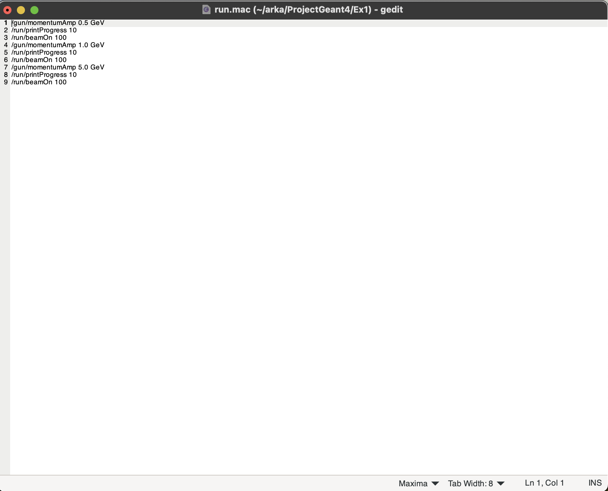
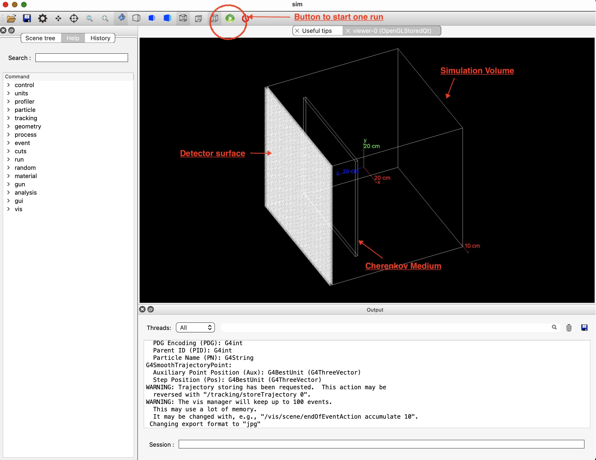
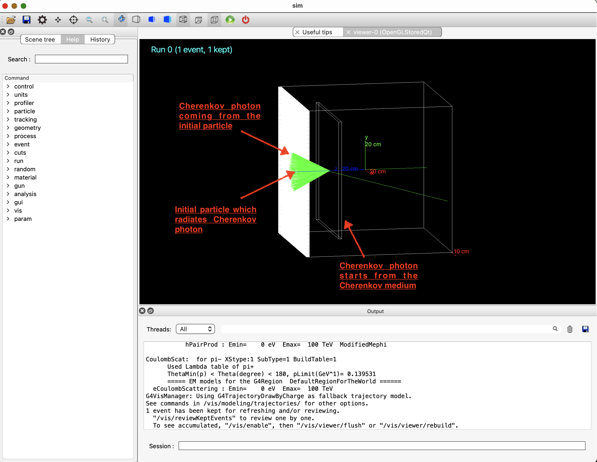
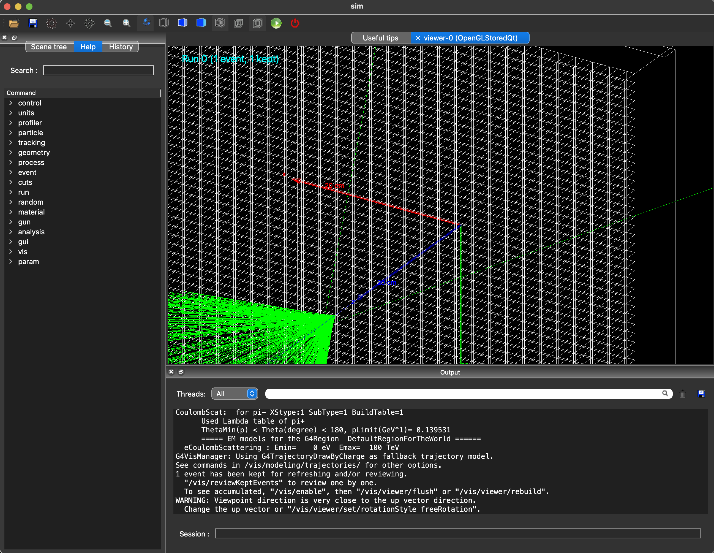
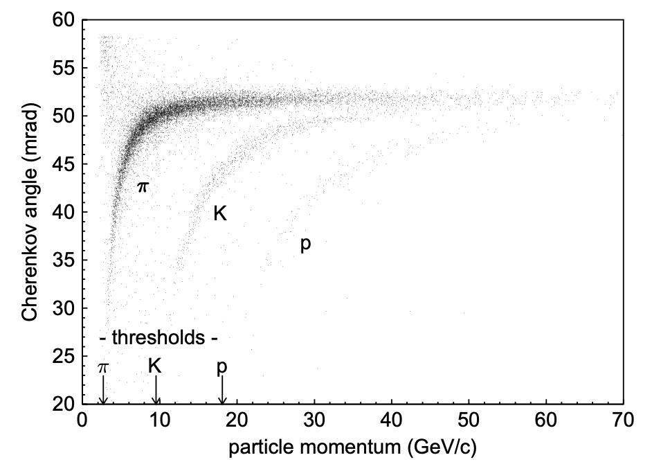

# Introduction 
This is a repository of Geant4. The goal is to generate Cherenkov light and detect them. 
You can know more about the Cherenkov light here on this [YouTube](https://www.youtube.com/watch?v=Yjx0BSXa0Ks&ab_channel=Fermilab) video.

## Code setup
The code is written using C++ following the class structure of Geant4.
If you want, this is a very good tutorial [video series](https://www.youtube.com/watch?v=Lxb4WZyKeCE&list=PLLybgCU6QCGWgzNYOV0SKen9vqg4KXeVL&ab_channel=PhysicsMatters) on Cherenkov light detector on Geant4.
The code setup is based exactly on this video series (upto Tutorial 9). 
*(This is a long video series. You can save the details for future.)*

# Useful commands for a Linux Terminal
This section highlights a few useful linux commands that may be used during this simulation project. 
1. Open a terminal window: if you are on Ubuntu, look for `terminal` app on the Ubuntu left side panel. Then click on it - this will open the terminal window which will be your main work area (don't forget to hit the `enter` button after typing out each command).

2. Go inside a directory: suppose you want to go inside the directory `Temp`. Then you have to do
```
cd Temp
```

3. Come out of a directory: suppose you need to come out of the directory `Temp`. Then you have to do (if you are already inside the directory `Temp`):
```
cd ..
```
(remember the space between `cd` and `..`)

4. Edit a file: you can use your favourite code editor, like `vim`, `emacs` or `VSCode`. For simplicity, we will use `gedit` code editor. If you need to edit a file (say `run.mac`), then you can open the file (first you have to go to the folder where the file exists):
``` 
gedit run.mac&
```
the trailing `&` is necessary to detach the terminal from `gedit`. 
After editing the file, you need to save the file by just pressing `control` and `s` keys together (`ctrl+s`) from the keyboard.

The interactive window may look like the following:




The `gedit` has many keyboard shortcuts similar to `MS Word`: for copying, use `ctrl+c` (meaning pressing `control` and `c` keys together); for pasting, use `ctrl+v`; for undo the recent edit, use `ctrl+z`.
One can simply put the cursor on the specific line wanted on the `gedit` window, and then start editing the file.

5. See the name of the folders or files in a particular location:
```
ls
```
this will list all the files/folders on the terminal at the location where you are standing.

6. To delete something in the terminal: to delete a file (say `myFile.txt`), simply type `rm myFile.txt` and hit enter; to delete a folder (say `Temp`) type `rm -rf Temp` and hit enter.

7. If you need to copy something from the terminal **on Ubuntu**, use `ctrl+shift+c` (meaning pressing the `control`, `shift` and the `c` keys together). For pasting on the terminal, use `ctrl+shift+v` (note the difference from the `gedit` commands). 


# Installation of the code setup
The code setup depends explicitly on Geant4 classes.
Before you compile the code, make sure that in your system, Geant4 is properly installed and sourced.
The instructions on Geant4 download and installation can be found on this [Geant4 Doc Page](https://geant4.web.cern.ch/docs/getting-started).

**For the BHU ISc Physics MSc final year nuclear physics lab PC, Geant4 is already installed.**
## Download the Cherenkov Code setup from git
1. Please first open a terminal. Then create a new repository (here `MyProject`) and go inside that: 
```
mkdir MyProject && cd MyProject
``` 

2. Download the git repository
```
git clone https://github.com/asantra/ProjectGeant4.git
```

3. Go inside the git repository and download the relevant tag:
```
cd ProjectGeant4
git checkout tags/Cherenkov -b CherenkovBranch
```

4. Make the repository using `cmake` (use the commands on the terminal one by one):
```
mkdir build && cd build
cmake ..
cmake --build . -j6
```

5. If there is no installation error message, then the code setup should be properly installed. 


# Running the setup
1. While inside the `build` directory, please look for the built object `sim` (you can use `ls` command).

2. You can run it interactively or in batch mode. 
- ## For intereactive running, please type the following command on the terminal inside the `build` directory: 
 ```
 ./sim
 ```
   - This should open a `QT` dialogue box. The experimental setup should be visible here. Example diagram is below:
   
   - Click on the green arrow button on the top panel. One click on this arrow will initiate one particle. The original particle (in blue) and Cherenkov light (in green) coming out of that should be clearly visible.
   
   - Here the Cherenkov medium is Silica gel (defined inside `construction.cc` file).
   - The detector surface is a dummy detector for simplicity (i.e. not real - because in reality we have to connect the detector to the photomultiplier tube and the detector electronics). If you zoom in on the detector surface, you will see 100 boxes in the `x` direction and 100 boxes in the `y` direction - 
   

   Each box has the length of 5 mm in `x` direction and 5 mm in `y` direction. The box is 10 mm thick (defined in `construction.cc`). 
   - You can click more on the green arrow to generate more events.
   - The interactive setup is good for 5-10 events; if we want to generate events in bulk (say around 1000), then we need to use the batch mode of running (simply because we cannot hit the green button 1000 times in a short time). 
   - Cross out the dialogue box (cross button on the top corner, either left or right depending on your operating system)
   - The output of the Cherenkov detection should be saved inside `output0.root` file. This file must be kept inside the `build` folder. 
   - This root file keeps only a few events: not very useful for us. You can delete the root files generated here by using the command: `rm output*.root`

- ## For batch mode running,  please type the following command on the terminal inside the `build` directory: 
 ```
 ./sim run.mac
 ```
   - This should initiate the batch mode of running, i.e. here you won't see any dialogue box.
   - If you are using the original `run.mac` (i.e. didn't edit anything there), then you should see three output files stored inside `build` directory:
    - output0.root for 0.5 GeV proton (100 events)
    - output1.root for 1.0 GeV proton (100 events)
    - output2.root for 5.0 GeV proton (100 events)

   - We will learn to analyze the root files later.

# Change the particles and its parameters. 
1. Emission of Cherenkov light depends on the particle velocity. The cone angle of Cherenkov light emission also depends on particle velocity.
2. There is a threshold velocity after which Cherenkov light is emitted: if the particle does not cross that threshold, then there is no Cherenkov light. The threshold depends on particle type and the Cherenkov medium. In this project, we are using _Silica gel as the Cherenkov medium_.
3. If we use different particle type and particle energy, then the detected Cherenkov light should be different too. This is why many particle physics experiments use the Cherenkov detectors to identify the particle. 
4. To change the momentum of the particle, please go inside the `run.mac` file in the top level directory of the repository (in this example: `ProjectGeant4`).
5. You will see lines:
```
/gun/momentumAmp 0.5 GeV
/run/printProgress 10
/run/beamOn 100
```
6. Here first line refers to the particle momentum of 0.5 GeV. The second line dictates after how many events you want a print out (here it is 10). The third line tells you how many particles we want to generate (here it is 100).
7. In the unedited `run.mac` file, there should be three sets of such commands: the first set corresponds to `output0.root`, the second corresponds to `output1.root` and so on. If there is a fourth set of commands appended to `run.mac`, the corresponding output file will be `output3.root`. If you see that your output files start from `output1.root` (and not `output0.root`), that means Cherenkov light was not generated for the first momentum in the `run.mac` file (here `0.5 GeV`). That momentum was below the Cherenkov threshold, hence no Cherenkov light.  
8. You can either change the values in the initial nine lines of `run.mac`, or you can append your lines to this file:
```
/gun/momentumAmp 10 GeV
/run/printProgress 20
/run/beamOn 200
```
9. This means we want to generate 10 GeV particle and the number of particles will be 200, and the print progression is 20 (i.e. `Geant4` will print the progress of the run in every 20 events). 
10. Now we have to use the following commands inside the `build` directory:
```
cmake ..
./sim run.mac
```
(rememeber, everytime you change anything to your `run.mac`, you need to run the above commands)
11. After the run, you should be able to find the output root files.
12. Changing the particle type is a little bit involved. Please go to the top level directory of the repository (in this example `ProjectGeant4`). If you are in the `build` directory then use `cd ..` to reach to the `ProjectGeant4`.
13. Go to the file `generator.cc` and look for this line:
```
G4String particleName = "proton";
```

14. This means we used `proton` as our particle. We can change to any charged particles (please use these names, otherwise `Geant4` may not understand your request):
> alpha, anti_proton, e+, e-, mu+, mu-, pi+, pi-, proton, tau+, tau-, kaon+, kaon-, B+,B-.

15. Please change to your desired particle name in the lines mentioned in step 11 above. Save the file `generator.cc`.
16. Now go to the `build` directory and compile the project again:
```
cd build
cmake ..
cmake --build . -j6
```
(rememeber, everytime you change anything to the files in `ProjectGeant4`, you need to run the above commands. _If you don't compile after making changes, then in your simulation run, the previous changes won't be considered_.)

17. If the compilation is successful, you can run the project just like before:
```
./sim run.mac
```

18. Remember one thing, _everytime you run the setup, the previous output root files are overwritten. If you need to keep the output files from the previous runs, please store the root files away from the `build` directory_. 

19. It is a good practice to rename the output root files according to the particle type and energy. You can rename the root files in the following way inside the `build` directory:
```
mv output0.root output_proton_0p5GeV.root
mv output1.root output_proton_1p0GeV.root
...
```
as `output0.root` belongs to 0.5 GeV proton and `output1.root` belongs to 1.0 GeV proton. Similarly for electron particle (after running on `electron` particles in `Geant4`), one can change the output root files to 
```
mv output0.root output_electron_0p5GeV.root
mv output1.root output_electron_1p0GeV.root
...
```

20. If you want to save the root files from proton in a separate folder (say `ProtonFiles` inside the `ProjectGeant4` repository) outside of `build` directory, then use the commands inside the `build` directory:
```
mkdir ../ProtonFiles
mv output_proton_*root ../ProtonFiles
```

Similarly, if you want to keep electron files away from the `build` directory then use the following commands from the `build` directory:
```
mkdir ../ElectronFiles
mv output_electron_*root ../ElectronFiles
```


# The simulation of the experiment
If you have followed all the instructios properly until now, then you should be able to:
1. run the setup in batch mode,
2. change the number of particles generated,
3. change the particle type and momentum,
4. rename the root files according to the particle type and momenta,
5. keep away the root files in a separate folder outside of `build`.

These skills will be necessary to carry out this simulation exercise.

## run for different particle momentum

1. First we will run for `proton` particles with `30` different momenta (units in `GeV`) and for `500` events each: 

> 0.1, 0.2, 0.5, 0.8, 1.0, 1.2, 1.5, 1.8, 2.0, 2.2, 2.5, 3.0, 3.5, 5.0, 6.0, 8.0, 10.0, 12.0, 15.0, 18.0, 21.0, 25.0, 30.0, 35.0, 40.0, 50.0, 60.0, 70.0, 80.0, 100.0.  

2. You can append the `run.mac` file with the new momenta values. There is a file with all the above momenta added: `run_moremomenta.mac` - you can simply run that file.
3. Save the root file names accordingly and store them away from the `build` directory.
4. Now we will do the same exercise (use the same momenta values) for these particles:
> alpha, e-, mu-, pi-, tau-.

If time permits, you can use two more mesons:
> kaon-, B-.
5. After each particle's run, store the output root files in separate folder away from `build` directory. These root files will be necessary to find the correlation between the particle type and the Cherenkov angle.
6. If you have done all the steps from 1 to 5 above, then your `data taking` part (actually `simulation` in this context) is complete. Now we will learn how to analyze the `data` and get the physics result.  
7. Here is a sample plot from HERA-B RICH detector (_the Cherenkov medium is different, so we may not get exactly the same plot_) which shows the correlation between the particle type and the Cherenkov angle. This is reproduced from Grupen & Shwartz, ``Particle Detectors":



8. After all the simulations are done, we will try to plot the Cherenkov angle as a function of the particle momentum and try to find any correlation between those plots with the particle type.

9. After **finishing** all of your simulation and analyses, you should delete the `MyProject` directory. But remember, once deleted, you will not be able to retrieve your files inside the `MyProject` directory. So delete this only if all of your works (simulation+analysis+plotting) are done. 

10. If you are inside the `MyProject/ProjectGeant4/build` directory, then follow the commands:
```
cd ../../..
rm -rf MyProject
```